# Parallel Digital Image Processing and Analysis

This project explores various parallel processing approaches for image analysis, being sequential-based, multithreaded-based, executor-based, forkJoinPool-based and finally a completableFutures-based implementation. In this document, we'll discuss each approach, provide code snippets, and present benchmark results to compare their performance across different image sizes and garbage collectors. In cases where an approach could have other alternatives for implementations, these will also be discussed along with their pros and cons and why we eventually choose the approach we did.

## Development Approach and Benchmarking Methodology

In this chapter, we outline the methodology used for benchmarking and the approach taken in the development of the solutions for parallel image processing.

### Development Approach

The digital processing of an image can be split into three steps. The conversion from image to data, the transformation of the data and finally the conversion to an image again.
Since an image in composed of pixels, an image can be converted to a matrix of pixels or colours, with width x and height y, and this is what is done in the first step.
For the second step, each pixel with coordinates _i_, _j_, where _i_ is the row and _j_ the column, is calculated from the initial image.
Taking this into account, a Filter interface can be established that represents the minimal behaviour of all filters which will be developed.

```java
public interface Filter {
    Color apply(int i, int j, Image image);
}
```

An example implementation, would be the GlassFilter, which works by, for a given pixel with coordinates _i_,_j_, generating a random offset for both the x and y axis and retrieving the color values of the pixel with the coordinates i + offsetX, j + offsetY, in the initial iamge.

```java
public class GlassFilter implements Filter {

    private int distance = 20;
    private final Random rand = new Random();
    int numberOfRows;
    int numberOfColumns;

    public GlassFilter(){};

    public GlassFilter(int distance) {
        this.distance = distance;
    }

    @Override
    public Color apply(int i, int j, Image imageToProcess){
        this.numberOfColumns = imageToProcess.width();
        this.numberOfRows = imageToProcess.height();
        int offsetI = rand.nextInt(distance) - distance * 2;
        int offsetJ = rand.nextInt(distance) - distance * 2;

        int randomI = Math.min(Math.max(0,i + offsetI), numberOfRows - 1);
        int randomJ = Math.min(Math.max(0,j + offsetJ), numberOfColumns - 1);

        return imageToProcess.obtainPixel(randomI, randomJ);
    }
}
```

With the usage of an interface that establishes the minimal behaviour of a filter, we can then implement the FilterExecutor which are the different solutions (Sequential, Multithreaded, ThreadPool-based) for the problem. These executors should, given an image, return back a new image, which has been processed.

```java
public interface FilterExecutor {
    Image apply(Image image);
}
```


### Benchmarking Methodology

## Filters

### Glass Filter

As previously explained. the GlassFilter works by, given pixel with coordinates _i_,_j_, generating a random offset, which can be negative, for both the x and y axis and retrieving the color values of the pixel with the coordinates i + offsetX, j + offsetY, in the initial image.

### Glass Filter - Benchmarks

#### Glass Filter - Image Benchmarks

| Benchmark                 | Samples | 8k Image Score | 8k Image Score Error (99.9%) | 4k Image Score | 4k Image Score Error (99.9%) | Small Image Score | Small Image Score Error (99.9%) |
|---------------------------|---------|----------------|-------------------------------|----------------|-------------------------------|-------------------|---------------------------------|
| completableFuturePerLine | 5       | 7739.261780    | 1252.001380                   | 1887.064360    | 92.516731                     | 79.936844        | 3.523413                        |
| completableFuturePerPixel| 5       | 7092.389150    | 2246.690649                   | 1208.736787   | 85.090632                     | 57.747872        | 9.410386                        |
| completableFuturePerSlice| 5       | 7829.474590    | 77.116882                     | 1821.689433   | 31.007254                     | 74.696001        | 6.712822                        |
| executorsPerLine         | 5       | 8262.183960    | 592.534809                    | 1699.535028   | 202.778771                    | 77.851912        | 10.779172                       |
| executorsPerPixel        | 5       | 80944.558740   | 2030.723514                   | 18492.394580  | 439.440437                    | 831.600114       | 37.323070                       |
| executorsPerSlice        | 5       | 8001.554440    | 100.171215                    | 1627.214043   | 15.414834                     | 64.515200        | 6.555251                        |
| forkjoin_10000           | 5       | 7817.528140    | 164.809497                    | 1806.339957   | 10.345312                     | 69.882948        | 6.101897                        |
| forkjoin_100000          | 5       | 7865.975200    | 200.407778                    | 1857.870827   | 51.107060                     | 56.079200        | 2.307965                        |
| forkjoin_5000            | 5       | 6478.724140    | 204.686358                    | 1620.071654   | 6.324680                      | 78.035718        | 2.827506                        |
| forkjoin_50000           | 5       | 7084.575920    | 129.444045                    | 1614.438634   | 20.988487                     | 77.514772        | 0.295224                        |
| multithreaded            | 5       | 8012.118840    | 346.554118                    | 1828.682093   | 12.498584                     | 66.593442        | 2.309548                        |
| sequential               | 5       | 928.900671     | 10.886830                     | 207.360871    | 2.318310                      | 9.080359         | 0.176076                        |

#### Glass Filter - Garbage Collector Benchmarks

|Benchmark                 |Samples| Z - Score       |Z - Score Error (99.9%)|Serial - Score | Serial - Score Error (99.9%)| G1 - Score | G1 - Score Error (99.9%) | Parallel - Score | Parallel - Score Error (99.9%)|
|--------------------------|-------|------------|-------------------|----------------|-----------------------------|----------------------------|----------------------------|----------------------------|----------------------------|
|completableFuturePerLine |5      |1581.023666 |343.701445         |1736.970107    |4.553858                     |1603.914151                |43.107482                  |1607.559709             |19.550396                |
|completableFuturePerPixel|5      |1769.057283 |752.992141         |1583.695120    |347.647630                   |1029.892580                |50.135086                  |1608.185296             |336.138500               |
|completableFuturePerSlice|5      |1790.478587 |72.316677          |1336.783078    |25.553297                    |1777.934300                |51.341580                  |1799.508990             |54.768573                |
|executorsPerLine         |5      |1673.971008 |64.880302          |1703.878303    |91.033694                    |1817.571197                |94.160392                  |1825.832737             |53.689025                |
|executorsPerPixel        |5      |18418.094800|732.595138         |18733.394340   |461.876264                   |18321.541200               |485.687824                 |18818.442220            |299.289915               |
|executorsPerSlice        |5      |1713.733023 |49.537416          |1520.631060    |7.445958                     |1402.124768                |39.093445                  |1628.582803             |137.458901               |
|forkjoin_10000           |5      |1623.975143 |38.195084          |1721.427597    |16.670710                    |1604.398583                |16.385185                  |1608.118183             |59.857639                |
|forkjoin_100000          |5      |1711.822773 |464.634728         |1423.625235    |47.038280                    |1832.476960                |7.700872                   |1451.305800             |32.410324                |
|forkjoin_5000            |5      |1613.474421 |151.246033         |1766.277360    |28.841035                    |1643.573348                |69.358180                  |1822.274093             |14.266949                |
|forkjoin_50000           |5      |1814.683049 |377.929352         |1756.662853    |85.996278                    |1816.207823                |9.813743                   |1639.250266             |7.609206                 |
|multithreaded            |5      |1741.859044 |229.454573         |1708.515700    |9.167169                     |1829.304097                |19.511226                  |1643.781434             |74.198657                |
|sequential               |5      |230.278223  |6.478090           |203.068864     |11.000674                    |207.602722                 |2.369742                   |203.815801              |1.730318                 |


## Brighter Filter

The goal of the brighter filter is to increment the brightness of each pixel by a specific ammount.
To calculate the brightness of each pixel, a mask must be used to combine the saturation of each color on each pixel,
calculting the average of the saturation, being that the brightness of said pixel.
To increment the brightness of any pixel, is just incrementing the value of each color by a specific ammount.
That said, the amount increase must be equal in all three colors, otherwise a hue shift is present, instead of a brightness,
culminating in the code exercerpt bellow.

```java

@Override
public Color apply(int i, int j, Image image) {
    Color color = image.obtainPixel(i, j);
    return new Color(Math.min(color.red() + brightness, MAX_HUE_VALUE),
            Math.min(color.green() + brightness, MAX_HUE_VALUE),
            Math.min(color.blue() + brightness, MAX_HUE_VALUE));
}
```

Moreover, it is important to understand that the implementation of the filter alone does not garantee the fastest
execution of said filter; there are many factors that influence the executions, increasing (or decreasing) the overall
velocity of the implementation.

As a result, a carfull and exaustive metric collection was performed to understand which factors influence positivelly
our implementations and which are detrements to our overall goal.
Thus, the metrics were divided using:
* Four categories of images to determine velocity scalability;
* Four garbage collectors to view how Java GCs may influence the overall performance;
* Five execution methods to see which implementation on each JGC is the best approach.

To make conclusions on the [extracted metrics](./benchmark_results/brighter/Brighter-Results.xlsx), Excel was used to generate useful charts that
increase the compreenshion of the results.

### Image Size

Since with increasing images size in the industry, it is relevant to analyze how diferent images size may
influence the performance of all or results.

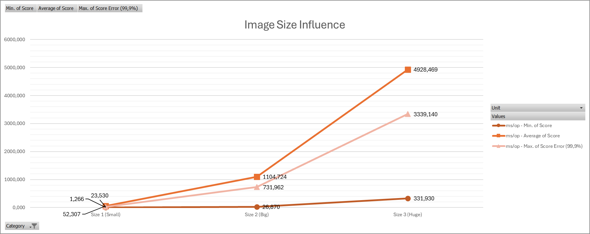

With the increment of image size, it is inevitable that the time of processing and filter application increases, however,
it is important to understand that the time increases exponentially.

Furthermore, it is important to normalize the data to properly scale and measure aproaches.


#### Small (Approx. 700x500 px)

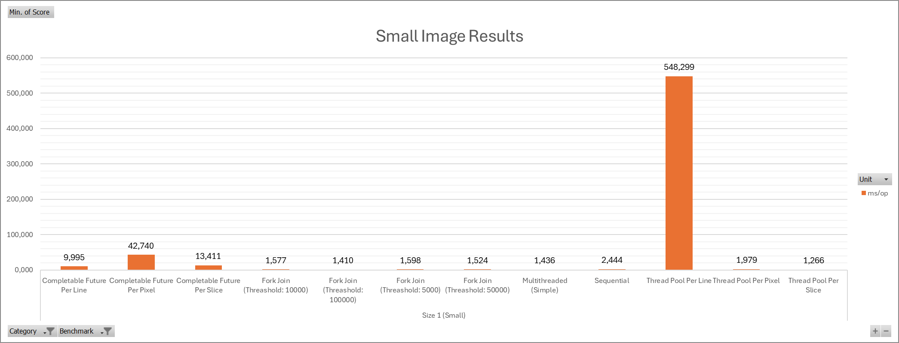

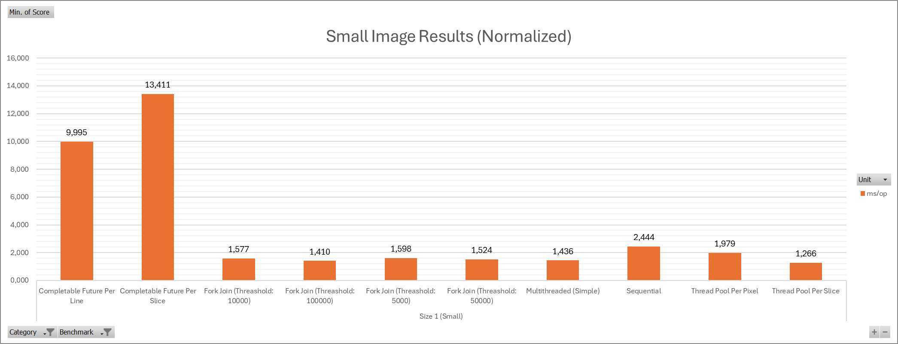

As expected, since the ammount of work in small images is relatively small, there is not a huge desparity in startegies
efficiency. Nevertheless, it is important to point out that two strategies come out as incredibly attrocious in terms of efficiency,
necessitating to excluded them from certain alnalysis (Thread Pool per Line and Completable Futures per pixel ).


#### Big (Approx. 3840x2160 px)


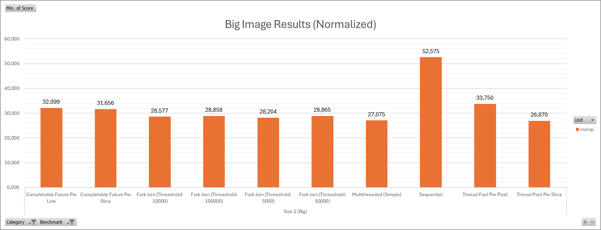

Differently from the [small image sizes](#small-approx-700x500-px), the results from
this size of images favour thread pool approaches, having the Thread Pool Per Slice method as the best methodology
for this filter.

#### Huge (Approx. 7300x4900 px)

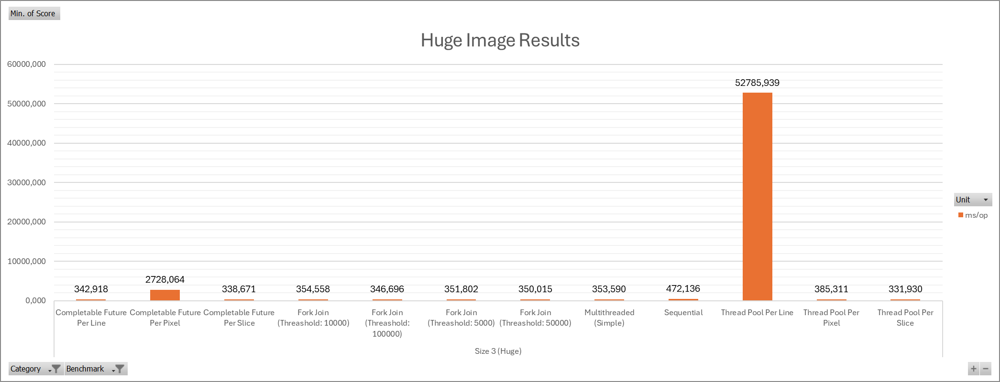

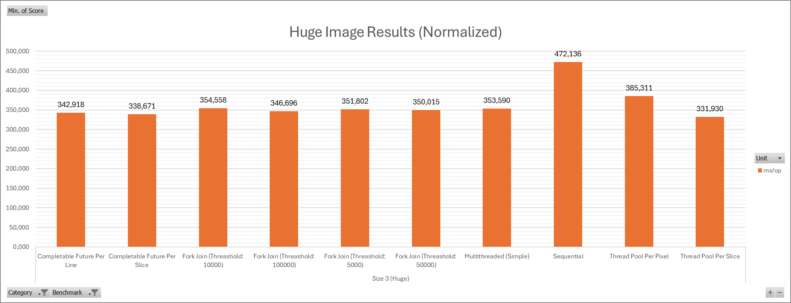

No different results can be interpreted from this data comparing it to the [results obtained with big images](#big-approx-3840x2160-px)

#### Conclusion

It is suprising that the Fork Join and Completable Futures approaches be worse than the
Thread Pool based, however, certain factors may explain this discrepancy, maybe for certain image sizes,
the memory that needs allocation may be a bigger detriment to the execution versus the benefits those aproches bring.
Other possible factor may well be the garbage collectors that may be more consistent with the thread pool aproach vs the others,
making it possible to have a combination of a garbage collector with fork join / completable futures that may indeed be
a better approach, but this topic will be better explored in [Garbage Collectors](#garbage-collectors) section.

### Strategies

#### Sequential vs Multithreaded (Simple)

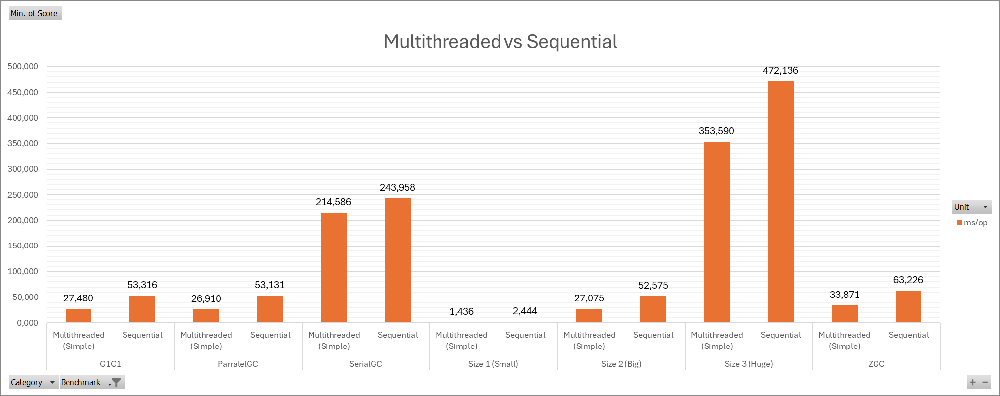


#### Thread Pool

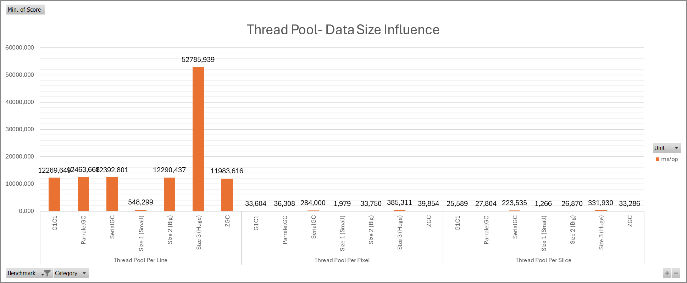


#### Fork Join

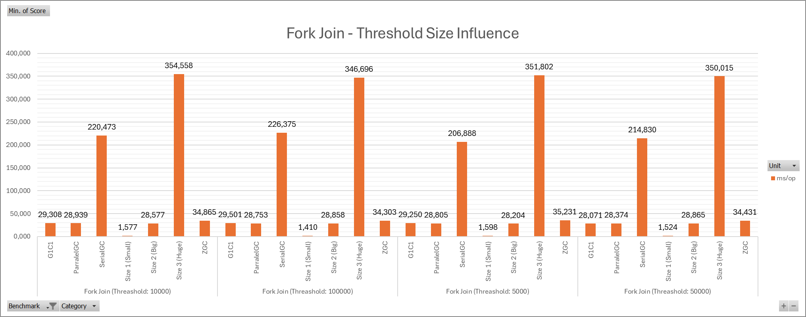

#### Completable Futures

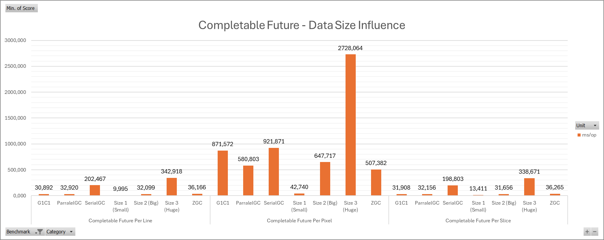

#### Conclusion

In conclusion, the hipotesis raised in the previous section were wrong. The thread pool approach is indeed the best aproach
and the most versitile for the Brighter Filter.


### Garbage Collectors

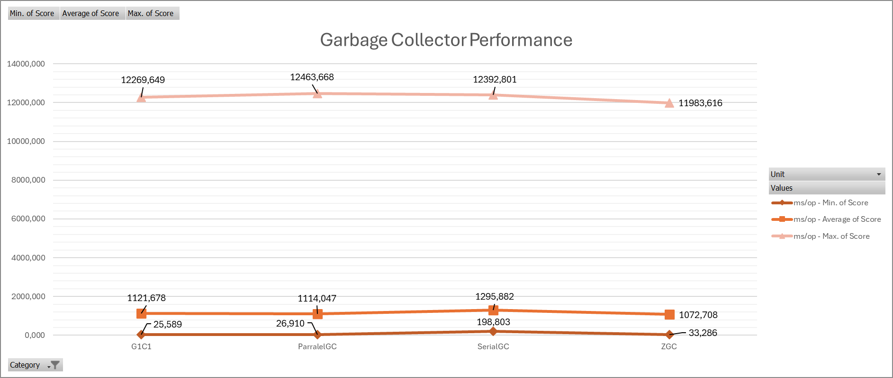

Comparison between different garbage collectors
#### SerialGC
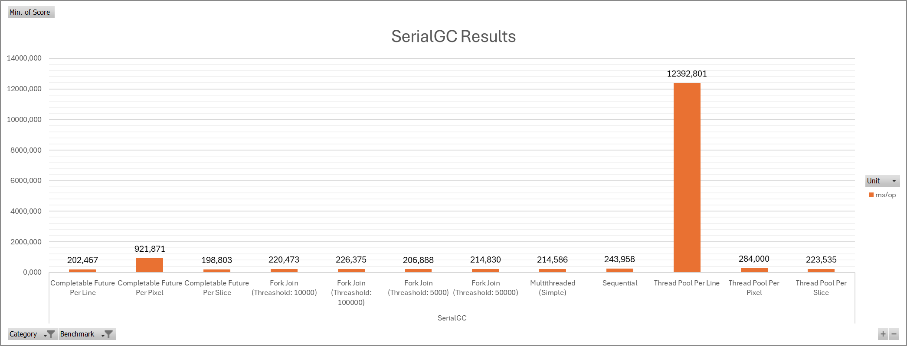

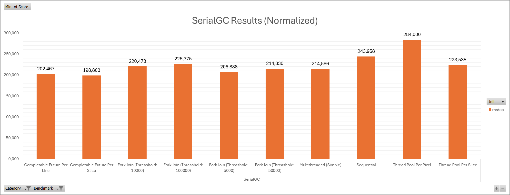
#### ParallelGC


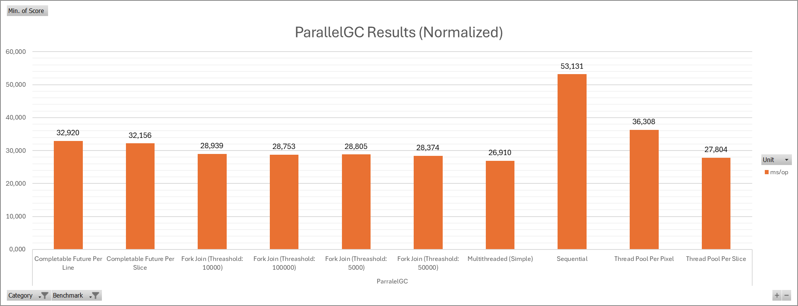

#### G1GC
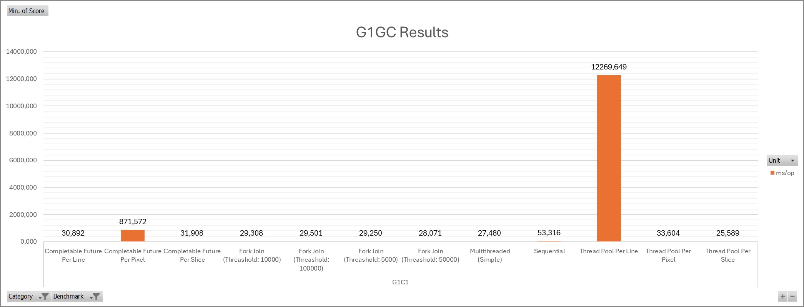


#### ZGC
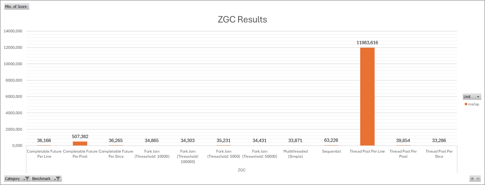


#### Conclusion

Having all that in mind, plus the other intrem conclusions, the best choice of garbage collection is the G1GC.


### Conclusion

The best combination of GC and Strategy, to be the most versitile and most eficient is the Thread Pool approach with
the G1 Garbage Collector.


<!-- ## Conclusion
[Write your conclusion here, summarizing findings and insights gained from the project.] -->
